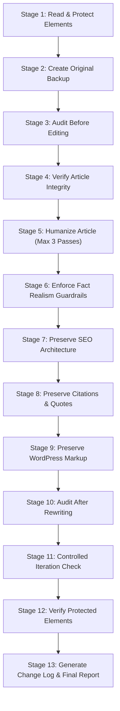

# SEO Article Humanizer: Enterprise Editorial & Pattern Audit Pipeline

The `seo-article-humanizer` skill orchestrates an end-to-end editorial humanization process for SEO articles, YouTube-derived guides, blog posts, and WordPress articles. It integrates with the core `.agents/skills/humanizer/SKILL.md` skill to detect 53 AI writing patterns, score writing-pattern density (0-100), and execute targeted humanization passes without compromising factual integrity, keyword targeting, or WordPress Gutenberg formatting.

---

## Strategic Principles & Rules

1. **Editorial Quality Over Evasion**: The primary objective is superior, engaging, human-level prose—NOT detector evasion.
2. **Zero Falsification**: NEVER insert fake personal anecdotes, fake first-hand experiences ("I bought this"), fabricated stats, or deliberate typos to "fake" humanity.
3. **Strict Fact & Element Preservation**: Every name, date, statistic, quote, URL, citation, image reference, and WordPress Gutenberg block markup MUST remain intact.
4. **Offline & Zero API Key Dependencies**: Operates entirely via local pattern detection and reasoning; requires zero external API keys or commercial detector network calls.

---

## 13-Stage Humanization Workflow Sequence

When invoked on an article (e.g. `outputs/<slug>/article/article.md` or `article.html`), execute the following steps in strict order:

### Stage 1: Read and Protect Content (Manifest Generation)
Read the source article and construct `protected-elements.json` containing:
- Factual claims, proper names, dates, dollar amounts, percentages.
- Exact direct quotations, author attributions, source titles, DOIs, URLs.
- Target primary and secondary SEO keywords.
- H1, H2, H3 headings and URL slug.
- Image paths, alt texts, captions, width/height dimensions.
- WordPress Gutenberg comment blocks (`<!-- wp:paragraph -->`, `<!-- wp:table -->`, `<!-- wp:image -->`).
- Embedded JSON-LD schema blocks (`BlogPosting`, `FAQPage`).

Save as: `outputs/<slug>/humanization/protected-elements.json`

### Stage 2: Create Original Backup
Copy the unedited source article into the output directory:
- `outputs/<slug>/humanization/article-original.md`
- `outputs/<slug>/humanization/article-original.html` (if source includes HTML)

### Stage 3: Pre-Rewrite Audit (`humanization-audit-before.md`)
Evaluate the article against the 53 AI writing patterns documented in `.agents/skills/humanizer/references/patterns.md`:
- Generate an internal AI-writing-pattern score (0-100).
- List exact flagged sentences, pattern IDs (e.g., `P1: Generic Intros`, `P10: Cliché Transitions`), and reasons.
- Highlight uniform sentence rhythms, robotic three-part lists, and filler phrases.

Save report as: `outputs/<slug>/humanization/humanization-audit-before.md`

### Stage 4: Fact & Source Integrity Audit
Verify all statistics, citations, and claims. Flag any unverified claims, placeholder text, or broken links for human review before proceeding to the rewrite phase.

### Stage 5: Execute Humanization Pass
Invoke humanization using the following baseline configuration:
- **Mode**: `rewrite` (or `edit` for targeted in-place adjustments)
- **Voice**: `professional` (or `technical`/`casual` depending on context)
- **Purpose**: `marketing` or `general`
- **Flags**: `--ignore-code --ignore-quotes`
- **Target Transformations**:
  - Vary sentence length and paragraph cadence (burstiness).
  - Remove cliché transitions (*Furthermore, Moreover, In conclusion, It is important to note*).
  - Replace vague buzzwords (*delve, tapestry, game-changer, robust, leverage, seamless*) with precise, concrete language.
  - Eliminate repetitive section summaries and formulaic intro/conclusion templates.

### Stage 6: Enforce Humanity Guardrails (Zero Falsification)
- DO NOT add fake personal stories ("In my 10 years testing this tool...").
- DO NOT introduce grammatical errors or typos.
- DO NOT invent quotes, statistics, or customer testimonials.

### Stage 7: Preserve SEO Architecture
Ensure the humanized article retains:
- Search intent alignment and primary keyword placement in title/first 100 words.
- H1, H2, H3 structural hierarchy.
- Meta title, meta description, and URL slug.
- Inbound and outbound links.

### Stage 8: Preserve Direct Quotations & Citations
Ensure zero alterations to text inside blockquotes (`>`), quoted phrases, academic DOIs, or legal disclaimers.

### Stage 9: Preserve WordPress & HTML Compatibility
For HTML/WordPress posts:
- Maintain valid Gutenberg block comment boundaries (`<!-- wp:... -->`).
- Preserve `<figure class="wp-block-image">` blocks and WordPress media IDs.
- Ensure HTML tables, shortcodes, and lists remain unbroken.

### Stage 10: Post-Rewrite Audit (`humanization-audit-after.md`)
Re-evaluate the humanized article against the 53 AI patterns:
- Record new pattern density score and delta change.
- List remaining patterns and justify any intentionally preserved technical phrases.

Save report as: `outputs/<slug>/humanization/humanization-audit-after.md`

### Stage 11: Controlled Iteration Gate
- Run a maximum of 3 rewrite passes.
- Stop iteration immediately if score reaches low risk (< 15/100), if delta improvement is < 3 points, or if further edits risk compromising facts or SEO.

### Stage 12: Protected Elements Verification
Cross-check `article-humanized.md` against `protected-elements.json` to confirm 100% preservation of names, dates, stats, links, schema, and media URLs.

### Stage 13: Generate Change Log & Final Report
Produce:
- `outputs/<slug>/humanization/humanization-change-log.md`: Itemized log of editorially meaningful changes.
- `outputs/<slug>/humanization/final-humanization-report.md`: Executive summary with before/after scores, verification status, and manual review items.
- Save final humanized files as:
  - `outputs/<slug>/humanization/article-humanized.md`
  - `outputs/<slug>/humanization/article-humanized.html`
