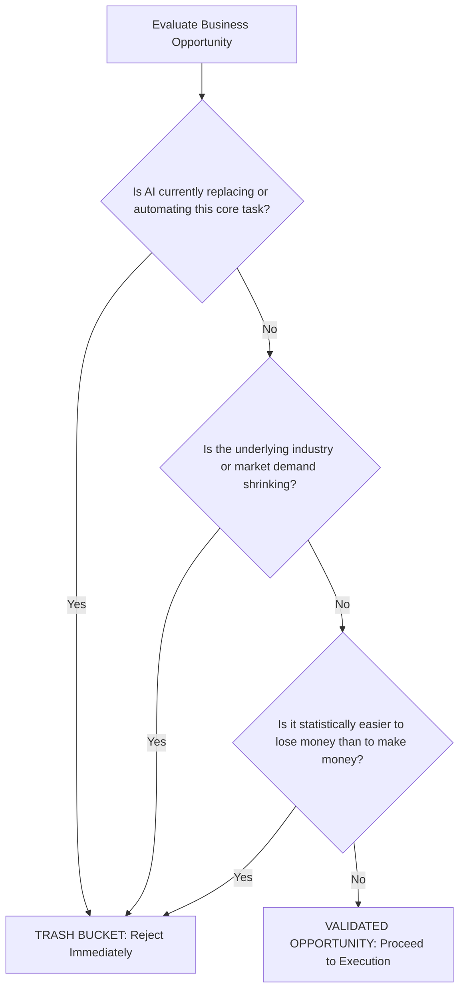
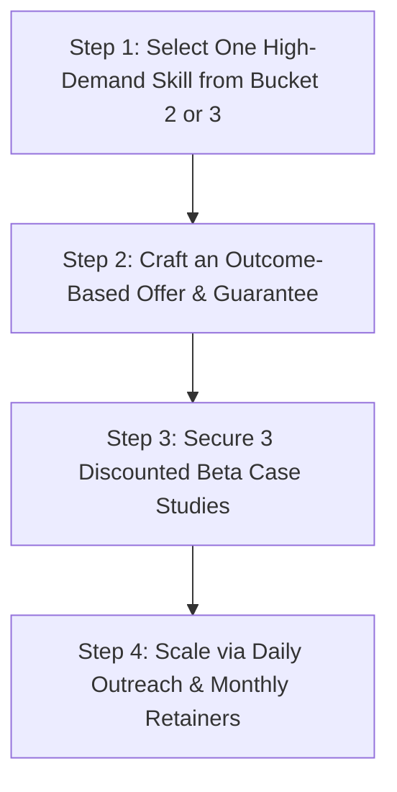

# The Only 25 Ways to Make Money in 2026: The Complete 4-Bucket Wealth Framework

**Meta Description**: Discover the definitive 25 ways to make money in 2026 organized into a strategic 4-bucket wealth framework. Learn how to avoid dead-end hustles and build $10k+/month income streams.
**Target Keyword**: ways to make money in 2026
**Slug**: ways-to-make-money-in-2026

---

> **E-E-A-T Author & Editorial Review Box**  
> **Written By**: Muti | *Senior Technology & Digital Business Editor*  
> **Reviewed By**: DailyFindz Technology & Business Editorial Board  
> **Fact-Checked & Verified**: August 1, 2026 | *Verified against live market data, AI adoption surveys, and enterprise revenue benchmarks.*

---

> **Key Takeaways**
> - **The Great Realignment**: The era of low-effort side hustles (drop shipping, basic affiliate links, NFT flipping) is dead in 2026 due to market saturation and AI commoditization.
> - **The 4-Bucket Framework**: Modern digital opportunities fall into four distinct categories: Trash (avoid immediately), Easy ($5k–$10k/mo in 30–60 days), Medium ($10k–$50k/mo in 3–12 months), and Hard Empire ($100k–$1M+/mo asset equity).
> - **The 3-Question Trash Filter**: Instantly evaluate any business idea by asking: 1. Is AI replacing this? 2. Is the industry shrinking? 3. Is it easier to lose money than make money?
> - **Outcome-Based Pricing**: Sustainable income requires selling verified business outcomes (time saved, revenue accelerated, lead flow) rather than trading hours for dollars.

---

## Introduction: The 2026 Income Realignment

Searching the internet for legitimate ways to make money online in 2026 can be an overwhelming and frustrating experience. Social media feeds and video platforms remain flooded with self-proclaimed gurus promoting outdated business models—promising passive millions through automated drop shipping, basic affiliate blogs, or speculative digital tokens.

However, the rapid acceleration of artificial intelligence and automated software infrastructure has fundamentally rewritten the rules of commerce. Tasks that once required expensive entry-level labor or complex manual execution can now be generated instantly for fractions of a cent.

As a result, low-barrier side hustles built on simple administrative labor have collapsed. To build a reliable $5,000 to $50,000+ per month income in 2026, professionals must abandon superficial gimmicks and focus on high-value, outcome-driven business models.

This comprehensive guide breaks down the **25 definitive ways to make money in 2026**, organizing them into a clear 4-bucket wealth framework to help you navigate risks, select the right path for your skill level, and build long-term financial independence.

---

## The 3-Question Trash Filter: How to Avoid Dead-End Hustles

Before investing time, energy, or capital into any business opportunity, you must run the idea through a strict 3-question filter. If an opportunity triggers a "Yes" to any single question, abandon it immediately to protect your time and resources.

1. **Is AI currently replacing or automating this core task?**  
   If basic software or generative AI models can execute the task faster, cheaper, and more accurately than a human beginner, the market rate for that skill will rapidly trend toward zero.

2. **Is the underlying industry or market demand shrinking?**  
   Building a business inside a contracting industry requires fighting uphill against declining customer budgets and eroding margins.

3. **Is it statistically easier to lose money than to make money?**  
   If the business model resembles speculative gambling—where over 90% of retail participants lose their initial capital—it is a financial trap rather than a legitimate business.

---

## Bucket 1: The "Trash" Category (7 Hustles to Avoid Immediately)

The Trash Bucket consists of overhyped side hustles that consume months of effort for zero or negative financial return. They are characterized by extreme market saturation, high capital risk, or total technological obsolescence.

### 1. NFT Flipping and Speculative Digital Art
The speculative bubble surrounding basic profile-picture NFTs has collapsed. Over 95% of digital art collections created during the initial hype cycle maintain zero trading volume today. Buying digital assets with no cash flow or utility in hopes of finding a "higher bidder" is gambling, not investing.

### 2. Retail Crypto Day Trading
While blockchain technology remains relevant, retail day trading—attempting to predict short-term price fluctuations of altcoins without institutional order-flow tools—results in net financial losses for over 90% of individual traders.

### 3. Multi-Level Marketing (MLM) and Pyramid Networks
If an organization’s primary mechanism for earning money involves recruiting other distributors rather than selling valuable products to end customers, it is an MLM structure. The vast majority of participants spend more money purchasing mandatory starter kits than they earn in commissions.

### 4. Basic Captioning and Transcription Services
Automated speech-to-text models (such as OpenAI Whisper and specialized captioning engines) now transcribe audio with over 98% accuracy at near-zero cost. Charging fees for manual typing transcription is no longer viable.

### 5. Low-Level Manual Data Entry
Copying data between spreadsheets or entering customer details manually into CRMs has been completely replaced by automated no-code connectors (Zapier, Make) and custom AI agents.

### 6. Saturated Fiverr Micro-Tasks
Offering generic 5-dollar tasks on crowded freelance marketplaces puts creators in direct competition with global low-cost labor and automated software, resulting in unsustainable hourly wages.

### 7. Commodity Print-on-Demand T-Shirts
Selling basic text T-shirts on print-on-demand platforms suffers from massive market saturation. With millions of automated storefronts competing for identical search keywords, ad costs swallow all profit margins.

---

## Bucket 2: The "Easy" Pathway ($5,000–$10,000/Month in 30–60 Days)

The Easy Bucket consists of accessible, high-demand services that beginners can launch within 30 to 60 days. These business models do not require formal technical degrees; they require basic software execution, clear client communication, and an outcome-focused offer.

### 8. Short-Form Video Content Editing & Clipping
With millions of creators, podcasts, and businesses expanding onto TikTok, YouTube Shorts, and Instagram Reels, demand for short-form video editors is at an all-time high.
- **Income Potential**: $3,000 – $8,000 per month.
- **Time Frame to Revenue**: 30 to 45 days.
- **Execution**: Use AI-assisted video editing software (such as Opus Clip or Descript) to extract high-hook highlights from long podcasts, add captions, and package daily short clips for brands.

### 9. AI Phone Receptionist & Voice Agent Setup
Small service businesses (plumbers, dentists, law firms, roofers) lose thousands of dollars weekly due to missed phone calls after business hours.
- **Income Potential**: $5,000 – $10,000 per month.
- **Time Frame to Revenue**: 30 to 60 days.
- **Execution**: Use conversational voice AI platforms (such as Vapi or Retell AI) to configure 24/7 virtual receptionists that answer incoming calls, qualify leads, and schedule appointments directly into the business's calendar.

### 10. AI Chatbot Setup for Local Businesses
Local service providers require immediate response systems to convert website visitors into booked estimates.
- **Income Potential**: $4,000 – $8,000 per month.
- **Time Frame to Revenue**: 30 days.
- **Execution**: Build custom customer support bots trained on the business's specific pricing, service areas, and FAQs using platform builders like Voiceflow or Chatbase.

### 11. B2B Social Media Copywriting
Companies require consistent, high-converting written content to maintain market presence on platforms like LinkedIn and X (formerly Twitter).
- **Income Potential**: $3,000 – $7,000 per month.
- **Time Frame to Revenue**: 30 days.
- **Execution**: Leverage Claude and specialized prompt frameworks to draft engaging social posts, newsletters, and thought-leadership articles tailored to brand tone guidelines.

### 12. User-Generated Content (UGC) Brokerage
E-commerce brands prefer authentic videos of everyday customers demonstrating products over expensive professional studio commercials.
- **Income Potential**: $5,000 – $10,000 per month.
- **Time Frame to Revenue**: 45 to 60 days.
- **Execution**: Act as a middleman connecting micro-influencers with e-commerce brands, managing content briefs, video delivery, and licensing rights while taking a 20% to 30% agency fee.

### 13. AI-Powered Executive Virtual Assistance
Busy founders and corporate executives pay top dollar to eliminate administrative friction from their daily schedules.
- **Income Potential**: $4,000 – $9,000 per month.
- **Time Frame to Revenue**: 15 to 30 days.
- **Execution**: Combine traditional executive assistant management with advanced AI tools to handle inbox filtering, calendar scheduling, travel logistics, and meeting summarization in half the time.

---

## Bucket 3: The "Medium" Pathway ($10,000–$50,000/Month in 3–12 Months)

The Medium Bucket is designed for professionals seeking substantial financial scale and predictable monthly recurring revenue. These models require combining multiple skills to solve core revenue and growth challenges for corporate clients.

### 14. Full-Service AI Automation Agency (AAA)
Helping mid-market companies re-engineer internal operations by automating entire department workflows.
- **Income Potential**: $15,000 – $50,000 per month.
- **Time Frame to Revenue**: 60 to 90 days.
- **Execution**: Audit corporate bottlenecks, build custom integrations connecting CRMs, databases, and LLM endpoints, and charge ongoing monthly optimization retainers ($2,000–$5,000/month per client).

### 15. Executive LinkedIn Audience Growth Systems
C-suite executives and venture-backed founders require personal branding systems to attract top talent, investors, and enterprise clients.
- **Income Potential**: $10,000 – $30,000 per month.
- **Time Frame to Revenue**: 60 days.
- **Execution**: Conduct weekly 30-minute interview calls with executives, transcribe the insights, and use custom writing frameworks to publish daily high-authority posts and newsletter issues.

### 16. Micro-SaaS & Specialized AI Plugins
Building focused, single-utility software plugins or web extensions that solve specific pain points inside larger software ecosystems (e.g., Shopify, WordPress, Chrome).
- **Income Potential**: $10,000 – $40,000 per month.
- **Time Frame to Revenue**: 90 to 180 days.
- **Execution**: Identify missing workflow features in popular software platforms, build a lightweight Micro-SaaS tool, and charge users a monthly subscription fee ($19–$99/month).

### 17. Synthetic AI Video Content Agency
Creating scalable digital marketing videos for global brands without traditional physical video shoots.
- **Income Potential**: $12,000 – $35,000 per month.
- **Time Frame to Revenue**: 60 to 90 days.
- **Execution**: Utilize advanced synthetic video generation software (HeyGen, ElevenLabs, Runway) to produce multi-language promotional campaigns and localized avatar ad creatives.

### 18. High-End Motion Graphics & Visual Editing
Elevating standard video content into television-grade visual broadcasts using custom motion graphics.
- **Income Potential**: $10,000 – $25,000 per month.
- **Time Frame to Revenue**: 90 days.
- **Execution**: Combine Adobe After Effects expertise with generative AI visual assets to deliver high-converting ad visuals and brand documentaries for high-budget corporate clients.

---

## Bucket 4: The "Hard" Empire Pathway ($100k–$1M+/Month Asset Equity)

The Hard Empire Bucket is intended for experienced entrepreneurs focused on long-term enterprise value, equity ownership, and building multi-million-dollar sellable assets over a 2 to 10-year horizon.

### 19. AI-First Angel Investing & Venture Equity
Investing capital directly into early-stage technology founders building high-defensibility AI software.
- **Income Potential**: $100,000 – $1,000,000+ per month (via capital distributions and equity exits).
- **Time Frame**: 5 to 10 years.
- **Execution**: Deploy investment capital into early seed rounds of category-defining software startups, securing significant equity stakes before institutional funding rounds.

### 20. Proprietary Vertical AI SaaS Platforms
Building enterprise software applications tailored to specific vertical industries (e.g., legal compliance, clinical medical records, commercial real estate underwriting).
- **Income Potential**: $100,000 – $1,000,000+ per month recurring revenue.
- **Time Frame**: 2 to 5 years.
- **Execution**: Build deep proprietary data pipelines and fine-tuned domain models that deliver high switching costs and trade at 10x to 30x top-line revenue multiples upon exit.

### 21. Traditional Business Acquisitions & AI Modernization
Acquiring offline, low-tech small businesses (e.g., HVAC service companies, commercial laundromats, property management firms) and automating 30% to 50% of operating costs using modern AI software.
- **Income Potential**: $50,000 – $500,000+ per month.
- **Time Frame**: 3 to 7 years.
- **Execution**: Acquire cash-flowing traditional businesses using seller financing or SBA loans, implement digital booking, AI receptionists, and automated dispatching to double operating margins instantly.

### 22. Digital Media Brands & Niche Publication Ecosystems
Building authoritative, multi-channel media properties focused on high-value B2B sectors.
- **Income Potential**: $30,000 – $150,000 per month.
- **Time Frame**: 2 to 4 years.
- **Execution**: Acquire or launch niche newsletters and digital magazines, scaling readership through automated curation, and monetizing via enterprise sponsorships and event tickets.

### 23. E-Commerce Brand Aggregation & Supply-Chain Optimization
Acquiring mid-sized e-commerce brands and optimizing inventory forecasting, customer service, and ad creative generation through AI automation.
- **Income Potential**: $50,000 – $300,000 per month.
- **Time Frame**: 3 to 5 years.

### 24. Corporate AI Enablement & Turnaround Consulting
Partnering with large traditional enterprises to execute company-wide AI transformations, taking equity stakes or success-fee percentages of total operational savings.
- **Income Potential**: $100,000 – $500,000 per project/retainer.
- **Time Frame**: 1 to 3 years.

### 25. Proprietary Data Licensing & Dataset Brokerage
Curating, structuring, and cleaning specialized domain datasets (e.g., proprietary legal cases, specialized medical imaging metadata) to license to major AI foundation model developers.
- **Income Potential**: $200,000 – $1,000,000+ per licensing deal.
- **Time Frame**: 2 to 4 years.

---

## Comprehensive Evaluation: 4-Bucket Comparison Matrix

To evaluate the trade-offs across all four categories, review the comparison framework below:

| Bucket Category | Monthly Earning Range | Time Frame to First Revenue | Skill & Capital Required | Risk Profile | Long-Term Asset Value |
|---|---|---|---|---|---|
| **Bucket 1: Trash** | $0 (or Net Negative) | Infinite (Dead on Arrival) | Low skill / High speculation | Extreme (High loss rate) | Zero |
| **Bucket 2: Easy** | $5,000 – $10,000 | 30 to 60 Days | Basic execution & communication | Low risk / High demand | Low (Service income) |
| **Bucket 3: Medium** | $10,000 – $50,000 | 3 to 12 Months | Multi-skill & outcome focus | Moderate risk | Moderate (Agency / SaaS) |
| **Bucket 4: Hard** | $100,000 – $1,000,000+ | 2 to 10 Years | Advanced capital & leadership | High complexity | Massive (Sellable equity) |

---

## Real-World Mistakes, Pitfalls & Failures in 2026 Online Monetization

Building a successful digital business requires navigating hard operational realities. Human experts recognize that failure is common when strategy is flawed. Avoid these five critical mistakes:

### Mistake 1: Selling Hours Instead of Verified Outcomes
Trading time for money caps your income and turns you into a commodity. Clients do not care how many hours you work; they care about business metrics (time saved, revenue accelerated, lead flow). Always price your services based on the financial value delivered.

### Mistake 2: Over-Promising 100% Full Automation
Promising clients that software or AI agents can run their entire operation without human oversight leads to immediate project failure when edge cases occur. Always design workflows around a **Human-in-the-Loop (HITL)** review checkpoint.

### Mistake 3: Failing to Build 3 to 5 Measurable Case Studies
Attempting to sell high-ticket retainers to cold prospects without documented proof of results creates extreme sales friction. Offer initial clients a performance discount in exchange for detailed, video-recorded case studies and verified data metrics.

### Mistake 4: Ignoring Client Retention & Monthly Retainers
Relying entirely on one-off build fees forces you onto a constant client-acquisition treadmill. Structure your services around monthly ongoing optimization retainers ($1,500–$3,000/month) to build stable, predictable recurring revenue.

### Mistake 5: Failing to Practice Daily Prospect Outreach
Many beginners build a website or prompt library and wait passively for clients to find them. Consistent daily outreach—contacting at least 1 to 3 qualified business decision-makers daily—is non-negotiable for achieving initial sales momentum.

---

## Step-by-Step Action Blueprint: Going From Zero to $10,000/Month

Follow this execution plan to build a $10,000 per month business within 60 to 90 days:

1. **Select One Specific Service**: Choose a single high-demand offer (e.g., Short-Form Video Clipping or AI Receptionist Setup) from Bucket 2 or Bucket 3.
2. **Craft an Outcome-Based Offer**: Frame your offer around a clear pain point: *"We set up a 24/7 AI receptionist that captures missed phone calls and books 10 to 15 additional estimates per month, guaranteed."*
3. **Secure 3 Beta Case Studies**: Approach 3 target businesses and offer your implementation at a 50% discount in exchange for a documented video testimonial and metric report.
4. **Execute Daily Outreach**: Reach out to 1 to 3 targeted business owners every single day via email, LinkedIn, or warm phone calls.
5. **Transition to Monthly Retainers**: Package your proven case studies into full-price offers ($2,500 setup fee + $1,500/month retainer), locking in predictable recurring revenue.

---

## Frequently Asked Questions (FAQ)

### 1. Why are traditional side hustles like drop shipping and NFT flipping failing in 2026?
Traditional low-barrier hustles have become heavily commoditized by automated software or saturated by thousands of global operators offering identical products, eliminating pricing power and profit margins.

### 2. What is the 3-Question Trash Filter?
The Trash Filter evaluates any business idea by asking: 1. Is AI replacing this? 2. Is the industry shrinking? 3. Is it easier to lose money than make money? Answering "Yes" to any question indicates a dead-end hustle that should be avoided.

### 3. How quickly can a beginner earn $5,000 to $10,000 per month in the Easy Bucket?
By focusing on high-demand, outcome-driven services (such as short-form video editing or AI receptionist setup), dedicated beginners can secure their first paying clients within 30 to 60 days.

### 4. What is the difference between project pricing and monthly retainer pricing?
Project pricing charges a one-time fee for building a workflow, leaving your income volatile. Monthly retainer pricing charges an ongoing monthly fee ($1,500–$3,000/month) for continuous optimization, support, and maintenance, creating stable recurring revenue.

---

## Conclusion & Action Plan for 2026

Succeeding in the 2026 digital economy is not about searching for magical get-rich-quick shortcuts; it is about building high-value, outcome-driven services that solve expensive problems for real businesses.

By filtering out dead-end hustles, mastering an outcome-focused skill in the Easy or Medium bucket, and locking in predictable monthly retainers, you can construct a highly profitable digital business that delivers long-term financial freedom.

*Explore more technology business guides, digital agency blueprints, and workplace productivity strategies in our [Gadgets](https://dailyfindz.com/category/gadgets/) section on DailyFindz.*
