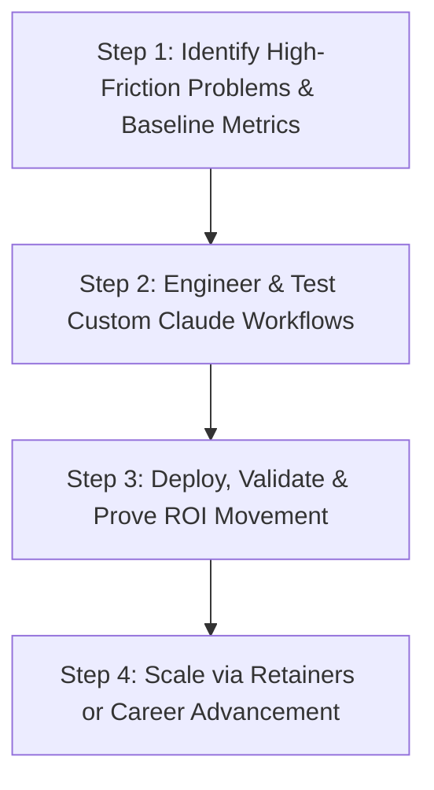

# How to Make Money with Claude AI in 2026: The Complete Consulting & Automation Guide

**Meta Description**: Discover how to make money with Claude AI in 2026 through high-value consulting, internal automation, and proven business integration blueprints. Learn how to avoid common AI consulting mistakes and build sustainable $3,000+/month retainers.
**Target Keyword**: how to make money with claude ai
**Slug**: how-to-make-money-with-claude-ai

---

> **Key Takeaways**
> - **Market Shift**: The era of selling generic, low-effort AI automations is ending as businesses demand proven operational returns and custom workflow integration.
> - **The Core Opportunity**: Claude AI consulting—helping businesses streamline complex internal workflows—has emerged as one of the highest-paying tech career pathways in 2026.
> - **Two Distinct Pathways**: Professionals can choose between high-freedom freelance consulting or stable in-house AI leadership roles with significant wage premiums.
> - **Human Realism & Common Pitfalls**: Real-world implementation requires acknowledging tool limitations, preventing prompt hallucinations, avoiding unapproved data exposure, and establishing human-in-the-loop oversight.
> - **Outcome-Driven Methodology**: Sustainable revenue requires identifying measurable business metrics (hours saved, error reduction, revenue accelerated) before writing a single system prompt.

---

## Introduction: The High-Stakes AI Economy in 2026

Artificial intelligence has evolved rapidly from an experimental curiosity into a foundational component of modern business operations. Major technology leaders—including Microsoft, Amazon, Alphabet, and Meta—are investing over $700 billion collectively in AI infrastructure and data centers. Yet despite this massive capital expenditure, many organizations struggle to convert their software investments into tangible bottom-line results.

According to research from the Massachusetts Institute of Technology (MIT), approximately 95% of generative AI pilot programs inside enterprise organizations fail to deliver measurable economic returns. Companies frequently purchase software subscriptions and launch isolated trials, only to discover that unguided AI adoption produces minimal operational impact.

The fundamental disconnect in today's market is not a lack of artificial intelligence capability, but a severe shortage of practical implementation expertise. Paying for software licenses is simple; re-engineering internal business workflows around AI models remains the primary bottleneck for modern enterprises.

This disconnect presents a substantial financial opportunity. Rather than attempting to launch generic agencies or build software products from scratch, forward-thinking professionals are leveraging Anthropic’s Claude to solve specific, high-cost operational bottlenecks. 

This guide provides a comprehensive, realistic analysis of **how to make money with Claude AI in 2026**, outlining market dynamics, career pathways, real-world implementation mistakes, evaluation frameworks, and a step-by-step blueprint to build a sustainable $3,000+ per month income stream.

---

## The 2026 Market Shift: Why Generic AI Agencies Are Fading

During the initial wave of commercial AI adoption between 2023 and 2024, the primary business model involved founding an AI automation agency (AAA) to sell basic chatbots, simple social media generators, and generic automated tasks to local small businesses. While this model generated initial enthusiasm, the marketplace matured rapidly, exposing severe structural flaws in superficial automation services.

### 1. Market Commoditization and Price Erosion
Basic automation workflows built on simple API calls or elementary no-code connectors became trivial to duplicate. As thousands of new operators entered the marketplace offering identical services, pricing power eroded quickly, triggering a competitive race to the bottom. Clients quickly realized that generic chatbots provided minimal business value and canceled subscriptions after a few months.

### 2. The Enterprise Implementation Bottleneck
Enterprise executives are no longer seeking novelty; they require deep operational integration. A comprehensive report by McKinsey & Company revealed that while 88% of surveyed organizations utilize AI in at least one business function, only 6% qualify as high performers capable of scaling implementations across their entire enterprise. 

The challenge facing modern organizations is not finding another AI tool, but figuring out how to embed AI into complex, existing team processes without breaking compliance, degrading quality, or confusing employees.

### 3. The Shift Toward Internal Outcome Consulting
To address this gap, companies are prioritizing specialized consulting talent—professionals who understand internal business logic, data governance, and operational workflows, and can configure Claude to execute complex, multi-step tasks reliably.

---

## What is a Claude AI Consultant?

A Claude AI consultant acts as a strategic bridge between complex business challenges and artificial intelligence capabilities. 

To visualize this relationship, consider a practical analogy:
- **Claude AI** is the high-performance engine.
- **The Client Organization** is the passenger seeking a specific destination.
- **The Consultant** is the expert driver who navigates the vehicle safely and efficiently to that destination.

Rather than selling software features or raw prompt templates, a successful consultant sells specific, verifiable business outcomes: reduced labor hours, lower compliance error rates, or accelerated client onboarding timelines. 

While Anthropic’s Claude represents the state-of-the-art reasoning engine for complex text analysis, long-context document synthesis, logic evaluation, and code generation, the underlying skill set—identifying business friction and engineering reliable AI workflows—transfers across evolving open-source and proprietary model architectures.

---

## Strategic Career Pathways: Freelance vs. In-House Consultant

Professionals entering the Claude AI ecosystem generally follow one of two distinct career structures: independent freelance consulting or corporate in-house leadership.

### Pathway 1: The Freelance AI Consultant
Freelance consultants operate as independent business owners, serving multiple client accounts on a project or monthly retainer basis.

- **Primary Advantage**: Unlimited earning potential and complete schedule autonomy. Independent advisors retain full control over client selection, project scope, and working locations.
- **Primary Challenge**: Revenue volatility and operational overhead. Independent operators must handle client acquisition, cold outreach, scope definition, invoicing, and service delivery simultaneously.

### Pathway 2: The In-House AI Specialist / Enablement Lead
In-house consultants embed directly within an existing organization, transforming internal processes from the inside as full-time employees or specialized contractors.

- **Primary Advantage**: High income stability, predictable benefits, and deep proprietary data access. In-house professionals possess contextual knowledge of company systems, team dynamics, and operational bottlenecks that external agencies cannot easily replicate.
- **Primary Challenge**: Fixed compensation structures and potential organizational inertia when introducing new technology workflows across resistant departments.

---

## Comprehensive Evaluation: Freelance vs. In-House Pathway

To assist in selecting the optimal approach for your career goals, the comparison matrix below outlines the key operational trade-offs between both models:

| Evaluation Metric | Freelance AI Consultant | In-House AI Specialist |
|---|---|---|
| **Earning Structure** | Variable ($1,500–$5,000/mo per retainer) | Stable (Salaried with performance bonuses) |
| **Client Acquisition** | Required continuously (Cold outreach, content) | None (Internal stakeholder management) |
| **Workplace Autonomy** | High (Remote flexibility & self-directed hours) | Moderate (Standard corporate schedule) |
| **System Access** | Restricted by external NDA & security protocols | Full access to internal databases & workflows |
| **Market Risk** | Higher (Client churn & budget cuts) | Lower (Protected by employment contract) |
| **Skill Premium** | High market-rate pricing flexibility | Industry average 62% wage premium (PwC data) |

---

## Real-World Mistakes, Pitfalls & Failures in Claude AI Consulting

Unlike simplistic marketing promises that depict AI consulting as an effortless path to passive income, real-world implementation is messy, iterative, and requires navigating hard operational realities. Human experts understand that things frequently go wrong during initial deployments. Acknowledging common pitfalls is essential for building a sustainable practice.

### Mistake 1: Over-Promising 100% Full Automation (The Hallucination Trap)
One of the most dangerous errors beginners make is promising clients that Claude can fully automate a complex business process without human supervision. 

- **The Reality**: LLMs can occasionally misinterpret ambiguous text, extrapolate false figures from messy tables, or generate plausible-sounding hallucinations when context is missing.
- **The Solution**: Always design workflows around a **Human-in-the-Loop (HITL)** validation checkpoint. Position Claude as an intelligent assistant that completes 80% to 90% of the heavy lifting, leaving final review and approval to a qualified human operator.

### Mistake 2: Violating Corporate Data Privacy & Security Protocols
Entering sensitive client information into public consumer model interfaces can create severe legal liabilities.

- **The Reality**: Enterprise clients maintain strict data governance policies under HIPAA, GDPR, or SOC2 frameworks. Pasting unapproved customer lists or confidential legal contracts into personal accounts can violate NDAs and destroy client trust.
- **The Solution**: Utilize enterprise-grade deployment environments—such as Claude Enterprise accounts, AWS Bedrock API instances, or Google Cloud Vertex AI integrations—where data privacy agreements guarantee that customer data is never used for model training.

### Mistake 3: Building Cool Prompts Without Setting a Baseline Metric
Many consultants spend weeks crafting intricate prompts for tasks that provide minimal economic value to the business.

- **The Reality**: If a business cannot measure how much time or money a workflow saves, executives will view the consulting expense as discretionary and cancel the contract during the next budget review.
- **The Solution**: Before writing a single line of prompt instructions, calculate the baseline metrics: *How many hours does this task currently take per week? What is the hourly cost of the staff executing it? What is the current error rate?*

### Mistake 4: Treating Prompt Engineering as a One-And-Done Setup
Assuming a prompt that works today will perform flawlessly across all future inputs is a common delusion.

- **The Reality**: Unstructured business inputs vary wildly. Edge cases—such as scanned PDFs with poor OCR, missing data fields, or unexpected formatting variations—will inevitably break static prompt templates.
- **The Solution**: Establish continuous monitoring and prompt iteration. Build robust error-handling guardrails within your system prompts that instruct Claude to explicitly flag ambiguous or incomplete inputs rather than guessing.

### Mistake 5: Failing to Train Client Teams (Ignoring Change Management)
Even the most brilliantly engineered Claude workflow will fail if the client's internal staff refuses to adopt it.

- **The Reality**: Employees often fear that AI tools will replace their jobs, or they find complex new procedures confusing, leading them to quietly revert to old manual habits.
- **The Solution**: Include comprehensive process documentation, video walkthroughs, and hands-on training sessions in your service package. Frame Claude as a capability multiplier that eliminates tedious administrative drudgery so employees can focus on higher-value strategic work.

---

## Step-by-Step Implementation Blueprint: Building a $3,000+/Month Business

To successfully monetize Claude AI in 2026, follow this structured, battle-tested four-step implementation blueprint:



### Step 1: Identify High-Friction Problems & Baseline Metrics
Begin by auditing a target department (e.g., customer support, legal compliance, sales ops, or content publishing) to identify repetitive, high-cost manual tasks performed weekly.

- **Focus on Structured Input / Output Tasks**: Look for processes where clear source documents exist (e.g., customer intake forms, vendor contracts, call transcripts) and structured outputs are required (e.g., summary tables, CRM updates, compliance checklists).
- **Define Explicit Metrics**: Establish clear baseline benchmarks:
  - *Current Manual Time*: 6 hours per week per employee.
  - *Current Hourly Labor Cost*: $45/hour ($270/week).
  - *Target AI Automated Time*: 45 minutes per week (saving ~5.25 hours/week).
  - *Annual Projected Value*: ~$12,000 in saved labor costs per team member.

### Step 2: Engineer and Test Custom Claude Workflows
Configure Claude using structured system prompts, clear role definitions, and explicit formatting constraints.

- **Use Structured System Prompts**: Define the role, context, task instructions, input boundaries, and output formatting explicitly.
- **Provide Few-Shot Examples**: Give Claude 2 to 3 high-quality examples showing messy inputs paired with ideal outputs.
- **Incorporate Negative Guardrails**: Tell Claude what *not* to do (e.g., *"Do not make assumptions if data is missing; explicitly output '[DATA MISSING]' for missing fields"*).

#### Example System Prompt Architecture for Business Workflows:

```text
[ROLE & CONTEXT]
You are an expert Senior Operations Analyst evaluating vendor service contracts for corporate compliance.

[INPUT DATA]
You will be provided with unstructured text extracted from vendor agreements.

[TASK INSTRUCTIONS]
1. Extract the Contract Start Date, Expiration Date, Auto-Renewal Clause Notice Period, and Total Contract Value.
2. Identify any indemnity clauses that exceed $50,000 in liability exposure.
3. Highlight any non-standard governing law jurisdictions (standard is Delaware or New York).

[GUARDRAILS & NEGATIVE CONSTRAINTS]
- Do NOT guess or extrapolate missing dates. If a date is not explicitly stated in the document, set the field value to "NOT SPECIFIED".
- Maintain a neutral, professional tone.

[OUTPUT FORMAT]
Return your analysis in valid JSON format matching the schema below:
{
  "contract_summary": { ... },
  "compliance_flags": [ ... ],
  "recommended_action": "APPROVE | MANUAL REVIEW REQUIRED"
}
```

### Step 3: Deploy, Validate & Prove ROI Movement
Demonstrate the solution under real-world operational conditions to validate reliability and measure results.

- **Run Side-by-Side Parallel Testing**: For the first two weeks, run the Claude workflow alongside traditional manual execution to verify output accuracy and refine edge-case handling.
- **Record Before-and-After Metrics**: Create a concise demonstration video and summary report detailing exact time savings, error reduction percentages, and user satisfaction metrics.
- **Gather Decision-Maker Sign-Off**: Present verified data directly to executive stakeholders to demonstrate clear financial return on investment.

### Step 4: Scale via Monthly Retainers or Role Advancement
Transform initial proof-of-concept success into predictable, long-term financial returns.

- **For Freelancers (Monthly Retainer Model)**: Package successful implementations into compelling case studies. Charge an initial setup fee ($2,000–$5,000) followed by an ongoing monthly optimization retainer ($1,500–$3,000/month per client) to maintain prompts, handle model updates, and train new staff.
- **For In-House Professionals (Career Advancement)**: Present your verified ROI metrics during performance reviews. Use documented wins to establish a new internal position—such as *Director of AI Enablement* or *Chief AI Officer*—leveraging your proven track record for significant salary increases.

---

## Detailed Evaluation: Pros and Cons Matrix of Monetizing Claude AI

Evaluating any technology business model requires analyzing both strategic advantages and operational risks.

### Advantages (Pros)

1. **High Profit Margins**: Service-based consulting and custom workflow engineering require minimal overhead capital compared to physical inventory or traditional SaaS software development.
2. **Rapid Prototyping & Time-to-Value**: Advanced reasoning models allow consultants to build, test, and deploy functional business solutions in days rather than months.
3. **Growing Corporate AI Budgets**: Global hiring studies indicate that specialized AI implementation skills represent one of the most acute talent shortages, driving premium consulting rates.
4. **Defensible Client Relationships**: Custom workflows tailored to proprietary business documents and internal team habits create sticky, long-term client engagements.

### Disadvantages (Cons)

1. **High Sensitivity to Quality Errors**: Configured workflows must maintain near-zero error rates; inconsistent outputs or hallucinations damage executive trust quickly.
2. **Complex Security & Compliance Requirements**: Enterprise clients enforce strict security protocols, requiring consultants to understand NDAs, data encryption, and enterprise API configurations.
3. **Rapid Technological Evolution**: AI model capabilities update frequently, requiring continuous professional development to keep prompts and workflows optimized.
4. **Client Expectations & Change Resistance**: Non-technical stakeholders often hold unrealistic expectations regarding full automation or resist changing established daily habits.

---

## Pros and Cons Matrix

| Evaluation Factor | Strategic Advantages (Pros) | Operational Challenges (Cons) |
|---|---|---|
| **Business Model** | High profit margins, minimal overhead capital, strong market demand | Requires continuous skill updates & active client management |
| **Client Value** | Direct, measurable ROI through time savings & error reduction | High sensitivity to initial workflow bugs or prompt failures |
| **Enterprise Adoption** | Corporate AI budgets expanding rapidly across industries | Strict compliance, data privacy, & security NDA requirements |
| **Career Security** | 62% average wage premium for verified implementation skills | Market noise requires strong proof of ROI to stand out |

---

## Enterprise Data Governance & Compliance Guidelines

When deploying Claude AI within enterprise corporate environments, strict compliance protocols must be maintained:

- **Enterprise Infrastructure Only**: Deploy workflows exclusively via enterprise-grade environments (such as Claude Enterprise accounts, AWS Bedrock, or GCP Vertex AI) that guarantee customer data is never retained or used for model training.
- **Zero Confidential Data Leakage**: Never paste unencrypted personally identifiable information (PII), medical records, or unapproved trade secrets into consumer-facing web chat interfaces.
- **Human Oversight Checkpoints**: Implement mandatory human review mechanisms for all legal contracts, financial calculations, and external customer-facing communications.

---

## Frequently Asked Questions (FAQ)

### 1. Why is the traditional AI automation agency (AAA) model fading in 2026?
Early AI agencies primarily sold superficial, generic automations like basic chatbots and auto-posting tools. As enterprise test projects failed to deliver clear ROI, businesses pivoted toward custom, outcome-focused internal consulting that integrates deeply with core business systems.

### 2. What is the main difference between a freelance and an in-house Claude consultant?
Freelance consultants operate independently, managing multiple client accounts, client acquisition, and flexible schedules with uncapped earning potential. In-house consultants work within a single organization, receiving stable salaries, corporate benefits, and deep access to internal proprietary databases.

### 3. Do I need an advanced computer science degree or coding background?
No. High-value Claude consulting focuses primarily on understanding business logic, workflow mapping, prompt engineering architecture, process documentation, and human change management rather than traditional low-level software programming.

### 4. How do I prevent Claude from generating hallucinations in financial or legal workflows?
Prevent hallucinations by providing structured reference documents (retrieval-augmented context), using explicit negative constraints in system prompts (instructing Claude to output "NOT SPECIFIED" when data is missing), and maintaining a human-in-the-loop review step for final approval.

### 5. What is a realistic income goal for a freelance Claude AI consultant?
A dedicated consultant who secures 2 to 3 ongoing monthly client retainers priced between $1,500 and $2,500 per month can consistently achieve a monthly revenue target of **$3,000 to $6,000+**, while maintaining manageable working hours.

### 6. How should I pitch Claude AI consulting services to non-technical business owners?
Avoid talking about technical model benchmarks, token counts, or parameter sizes. Focus your pitch entirely on business metrics: *"We identify repetitive tasks taking your staff 10 hours a week and build a secure workflow that reduces that time to 1 hour, saving your business $15,000 annually."*

---

## Conclusion & Practical Action Plan for 2026

Learning **how to make money with Claude AI** is fundamentally an exercise in business problem-solving rather than technological novelty. As enterprise organizations continue pouring billions into AI infrastructure, the highest financial rewards will accrue to practical implementation specialists who can bridge the gap between software capabilities and measurable business ROI.

Whether you choose to launch an independent consulting practice or establish yourself as the primary AI specialist within your current company, focusing on high-friction operational problems, maintaining strict data security, and embracing real-world trial and error offers the clearest path to long-term professional success in 2026.

*Explore more technology business guides, AI operational frameworks, and digital workplace insights in our [Gadgets](https://dailyfindz.com/category/gadgets/) section on DailyFindz.*
